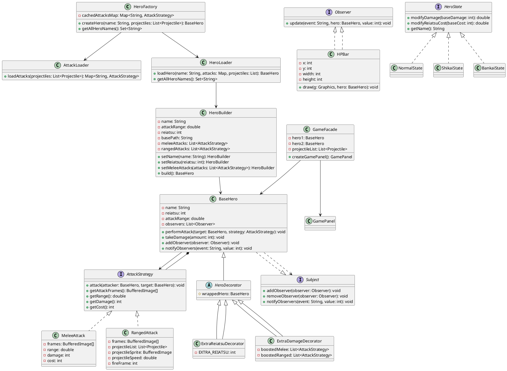
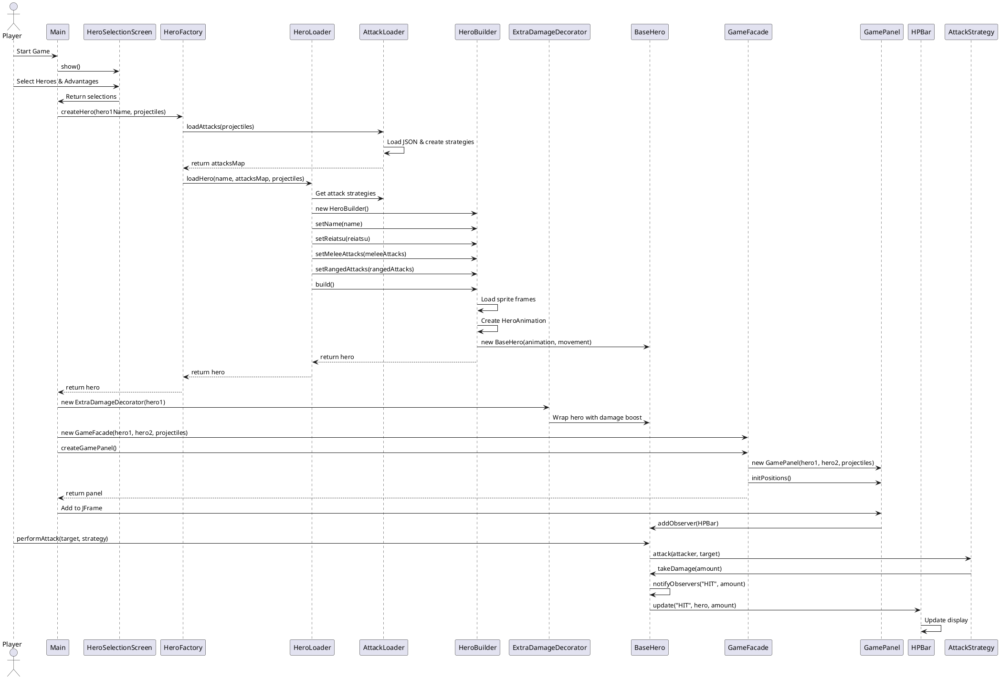

# Final Project Report

## Bleach: Rebirth of Souls

**Team Members:** Sanat Mansur Nurkeldi  
**Project Name:** Bleach Game  
**Date:** [Current Date]

---

## Table of Contents

1. [Introduction](#introduction)
2. [Body](#body)
   - [2.1 Design Pattern 1: Factory Pattern](#21-design-pattern-1-factory-pattern)
   - [2.2 Design Pattern 2: Strategy Pattern](#22-design-pattern-2-strategy-pattern)
   - [2.3 Design Pattern 3: Decorator Pattern](#23-design-pattern-3-decorator-pattern)
   - [2.4 Design Pattern 4: Facade Pattern](#24-design-pattern-4-facade-pattern)
   - [2.5 Design Pattern 5: Observer Pattern](#25-design-pattern-5-observer-pattern)
   - [2.6 Design Pattern 6: State Pattern](#26-design-pattern-6-state-pattern)
   - [2.7 Design Pattern 7: Builder Pattern](#27-design-pattern-7-builder-pattern)
3. [UML Diagrams](#uml-diagrams)
   - [3.1 Class Diagram](#31-class-diagram)
   - [3.2 Sequence Diagram](#32-sequence-diagram)
4. [Screenshots](#screenshots)
5. [Conclusion](#conclusion)
6. [Further Work](#further-work)
7. [Team Roles](#team-roles)

---

## Introduction

The **Bleach: Rebirth of Souls** project is a 2D fighting game inspired by the popular anime series Bleach. The game features multiple playable characters (heroes) with unique abilities, attacks, and combat mechanics. Players can select characters, customize their advantages, and engage in combat using a variety of melee and ranged attacks.

This project was developed using Java with Swing for the graphical user interface. The implementation follows object-oriented design principles and incorporates multiple design patterns to ensure code modularity, maintainability, and extensibility. The use of design patterns allows for a clean separation of concerns, making the codebase easier to understand, test, and extend with new features.

The game architecture is built around seven core design patterns: Factory, Strategy, Decorator, Facade, Observer, State, and Builder. Each pattern serves a specific purpose in the system and works together to create a unified, cohesive game engine. This report provides a detailed analysis of each pattern, explaining their purpose, structure, implementation, and necessity within the project context.

---

## Body

### 2.1 Design Pattern 1: Factory Pattern

#### Purpose

The Factory Pattern is a creational design pattern that provides an interface for creating objects without specifying the exact class of object that will be created. This pattern encapsulates object creation logic and centralizes it, making the code more maintainable and flexible.

#### Structure

The Factory Pattern in our project consists of:

- **HeroFactory**: Main factory class that provides a static method to create hero instances
- **HeroLoader**: Loads hero data from JSON files and uses the Builder pattern
- **AttackLoader**: Loads attack strategies from JSON files and creates appropriate strategy objects

#### Implementation in Project

```java
// HeroFactory.java
package factory;

import heroes.BaseHero;
import strategy.Projectile;
import java.util.List;
import java.util.Map;

public class HeroFactory {
    private static Map<String, strategy.AttackStrategy> cachedAttacksMap = null;

    public static BaseHero createHero(String name, List<Projectile> sharedProjectiles) {
        if (cachedAttacksMap == null) {
            cachedAttacksMap = AttackLoader.loadAttacks(sharedProjectiles);
        }
        return HeroLoader.loadHero(name, cachedAttacksMap, sharedProjectiles);
    }

    public static Set<String> getAllHeroNames() {
        return HeroLoader.getAllHeroNames();
    }
}
```

```java
// AttackLoader.java - Part of Factory Pattern
package factory;

public class AttackLoader {
    public static Map<String, AttackStrategy> loadAttacks(List<Projectile> sharedProjectiles) {
        Map<String, AttackStrategy> attacksMap = new HashMap<>();
        
        // Load from JSON and create appropriate attack strategies
        if ("melee".equals(type)) {
            attack = new MeleeAttack(frames, range.doubleValue(), 
                                    damage.intValue(), reiatsuCost.intValue());
        } else if ("ranged".equals(type)) {
            attack = new RangedAttack(frames, sharedProjectiles, projectileSprite,
                                     projectileSpeed.doubleValue(), range.doubleValue(),
                                     damage.intValue(), reiatsuCost.intValue(), fireFrameInt);
        }
        
        attacksMap.put(id, attack);
        return attacksMap;
    }
}
```

#### Why It Is Necessary

The Factory Pattern is essential in this project for several reasons:

1. **Data-Driven Design**: Heroes and attacks are loaded from JSON configuration files, allowing game designers to add new content without modifying code
2. **Complex Object Creation**: Hero creation involves multiple steps (loading sprites, parsing JSON, creating attacks, building animation objects), which is encapsulated in the factory
3. **Dependency Injection**: The factory handles dependency management (e.g., shared projectile lists) automatically
4. **Caching**: Attack loading is cached to avoid redundant file I/O operations
5. **Abstraction**: Client code (Main.java) doesn't need to know the internal details of hero or attack creation

---

### 2.2 Design Pattern 2: Strategy Pattern

#### Purpose

The Strategy Pattern defines a family of algorithms, encapsulates each one, and makes them interchangeable. This pattern allows the algorithm to vary independently from clients that use it.

#### Structure

The Strategy Pattern in our project consists of:

- **AttackStrategy**: Interface defining the contract for all attack behaviors
- **MeleeAttack**: Concrete strategy for close-range attacks
- **RangedAttack**: Concrete strategy for projectile-based attacks
- **CeroAttack**: Special ranged attack strategy
- **KidoAttack**: Special attack strategy for magical abilities

#### Implementation in Project

```java
// AttackStrategy.java - Strategy Interface
package strategy;

import heroes.BaseHero;
import java.awt.image.BufferedImage;

public interface AttackStrategy {
    void attack(BaseHero attacker, BaseHero target);
    BufferedImage[] getAttackFrames();
    double getRange();
    int getDamage();
    int getCost();
}
```

```java
// MeleeAttack.java - Concrete Strategy
package strategy;

public class MeleeAttack implements AttackStrategy {
    private BufferedImage[] frames;
    private double range;
    private int damage;
    private int cost;

    @Override
    public void attack(BaseHero attacker, BaseHero target) {
        attacker.reduceReiatsu(cost);
        if (attacker.distanceTo(target) <= range) {
            target.takeDamage(getDamage());
        }
    }
    
    // ... other methods
}
```

```java
// RangedAttack.java - Concrete Strategy
package strategy;

public class RangedAttack implements AttackStrategy {
    protected List<Projectile> projectileList;
    protected BufferedImage projectileSprite;
    protected double projectileSpeed;
    protected int fireFrame;

    @Override
    public void attack(BaseHero attacker, BaseHero target) {
        int frame = attacker.getAttackFrame();
        if (frame == fireFrame && !fired) {
            attacker.reduceReiatsu(cost);
            fireProjectile(attacker, target);
            fired = true;
        }
        if (frame == frames.length - 1) {
            fired = false;
        }
    }
    
    private void fireProjectile(BaseHero attacker, BaseHero target) {
        Projectile p = new Projectile(attacker.getX(), attacker.getY(), 
                                      target, projectileDamage, projectileSprite,
                                      attacker.isMovingRight());
        p.speed = projectileSpeed;
        projectileList.add(p);
    }
    
    // ... other methods
}
```

```java
// Usage in BaseHero.java
public void performAttack(BaseHero target, AttackStrategy strategy) {
    if (strategy == null) return;
    if (attacking) return;
    
    this.attackStrategy = strategy;
    attacking = true;
    state = HeroState.ATTACK;
    // ... attack execution
}
```

#### Why It Is Necessary

The Strategy Pattern is crucial for this project because:

1. **Multiple Attack Types**: The game supports various attack types (melee, ranged, special abilities) that behave differently
2. **Runtime Flexibility**: Heroes can switch between different attacks dynamically during gameplay
3. **Extensibility**: New attack types can be added by implementing the `AttackStrategy` interface without modifying existing code
4. **Separation of Concerns**: Attack logic is separated from hero logic, making both easier to maintain
5. **Combo System**: Heroes can have multiple attacks stored in lists, allowing for combo mechanics

---

### 2.3 Design Pattern 3: Decorator Pattern

#### Purpose

The Decorator Pattern allows behavior to be added to individual objects dynamically without affecting the behavior of other objects from the same class. It provides a flexible alternative to subclassing for extending functionality.

#### Structure

The Decorator Pattern in our project consists of:

- **BaseHero**: The component interface/class that defines the base object
- **HeroDecorator**: Abstract decorator that wraps a BaseHero instance
- **ExtraReiatsuDecorator**: Concrete decorator that adds extra health/reiatsu
- **ExtraDamageDecorator**: Concrete decorator that boosts attack damage
- **DamageBoostAttackDecorator**: Decorator for attack strategies that increases damage

#### Implementation in Project

```java
// HeroDecorator.java - Abstract Decorator
package heroes;

public abstract class HeroDecorator extends BaseHero {
    protected BaseHero wrappedHero;

    public HeroDecorator(BaseHero hero) {
        super(hero.getAnimation(), hero.getMovement());
        this.wrappedHero = hero;
        // Copy all properties from wrapped hero
        this.setName(hero.getName());
        this.setReiatsu(hero.getReiatsu());
        this.setAttackRange(hero.getAttackRange());
    }

    // Delegate all methods to wrapped hero by default
    @Override
    public void update() {
        wrappedHero.update();
    }
    
    // ... other delegated methods
}
```

```java
// ExtraReiatsuDecorator.java - Concrete Decorator
package heroes;

public class ExtraReiatsuDecorator extends HeroDecorator {
    private static final int EXTRA_REIATSU = 50;

    public ExtraReiatsuDecorator(BaseHero hero) {
        super(hero);
        int currentReiatsu = hero.getReiatsu();
        wrappedHero.setReiatsu(currentReiatsu + EXTRA_REIATSU);
    }

    @Override
    public int getReiatsu() {
        return wrappedHero.getReiatsu();
    }
}
```

```java
// ExtraDamageDecorator.java - Concrete Decorator
package heroes;

public class ExtraDamageDecorator extends HeroDecorator {
    private List<AttackStrategy> boostedMelee;
    private List<AttackStrategy> boostedRanged;

    public ExtraDamageDecorator(BaseHero hero) {
        super(hero);
        wrapAttacksWithDamageBoost();
    }

    private void wrapAttacksWithDamageBoost() {
        boostedMelee = new ArrayList<>();
        for (AttackStrategy attack : wrappedHero.getMeleeAttacks()) {
            boostedMelee.add(new DamageBoostAttackDecorator(attack));
        }
        wrappedHero.setMeleeAttacks(boostedMelee);
        
        // Similar for ranged attacks
    }
    
    // ... override methods to use boosted attacks
}
```

```java
// Usage in Main.java
BaseHero hero1 = HeroFactory.createHero(hero1Name, sharedProjectiles);

// Apply decorators based on advantage choices
if ("Extra Reiatsu".equals(player1Advantage)) {
    hero1 = new ExtraReiatsuDecorator(hero1);
} else if ("Extra Damage".equals(player1Advantage)) {
    hero1 = new ExtraDamageDecorator(hero1);
}
```

#### Why It Is Necessary

The Decorator Pattern is essential because:

1. **Player Customization**: Players can select advantages (Extra Reiatsu or Extra Damage) that modify hero capabilities without creating separate hero classes
2. **Composition Over Inheritance**: Avoids creating a combinatorial explosion of subclasses (e.g., HeroWithReiatsu, HeroWithDamage, HeroWithBoth)
3. **Runtime Modification**: Decorators can be applied dynamically based on player choices
4. **Stacking Behavior**: Multiple decorators could theoretically be stacked (though current implementation uses single decorators)
5. **Flexible Enhancement**: Easy to add new hero enhancements without modifying existing hero classes

---

### 2.4 Design Pattern 4: Facade Pattern

#### Purpose

The Facade Pattern provides a unified interface to a set of interfaces in a subsystem. It defines a higher-level interface that makes the subsystem easier to use by hiding its complexity.

#### Structure

The Facade Pattern in our project consists of:

- **GameFacade**: Simplifies the complex game initialization process
- **Subsystems**: GamePanel, BaseHero, Projectile management, etc.

#### Implementation in Project

```java
// GameFacade.java
package core;

import heroes.BaseHero;
import strategy.Projectile;
import java.util.List;

public class GameFacade {
    private BaseHero hero1;
    private BaseHero hero2;
    private List<Projectile> projectileList;

    public GameFacade(BaseHero hero1, BaseHero hero2, List<Projectile> sharedProjectiles) {
        this.hero1 = hero1;
        this.hero2 = hero2;
        this.projectileList = sharedProjectiles;
    }

    public GamePanel createGamePanel() {
        GamePanel panel = new GamePanel(hero1, hero2, projectileList);
        panel.initPositions();
        return panel;
    }
}
```

```java
// Usage in Main.java
GameFacade game = new GameFacade(hero1, hero2, sharedProjectiles);
GamePanel panel = game.createGamePanel();

JFrame frame = new JFrame("Bleach Fighters");
frame.setDefaultCloseOperation(JFrame.EXIT_ON_CLOSE);
frame.add(panel);
frame.pack();
frame.setVisible(true);
```

#### Why It Is Necessary

The Facade Pattern is important because:

1. **Simplified Interface**: Hides the complexity of initializing GamePanel with heroes and projectiles
2. **Encapsulation**: Client code (Main.java) doesn't need to know about GamePanel's internal initialization requirements
3. **Centralized Initialization**: All game setup logic is in one place, making it easier to maintain
4. **Future Extensibility**: If game initialization becomes more complex (e.g., adding backgrounds, sound systems), the facade can handle it without affecting clients
5. **Clean Separation**: Separates high-level game orchestration from low-level component details

---

### 2.5 Design Pattern 5: Observer Pattern

#### Purpose

The Observer Pattern defines a one-to-many dependency between objects so that when one object changes state, all its dependents are notified and updated automatically.

#### Structure

The Observer Pattern in our project consists of:

- **Subject**: Interface defining methods for attaching, detaching, and notifying observers
- **Observer**: Interface defining the update method for observers
- **BaseHero**: Implements Subject interface
- **HPBar**: Implements Observer interface to display hero health/reiatsu changes

#### Implementation in Project

```java
// Subject.java - Observer Pattern Interface
package observer;

public interface Subject {
    void addObserver(Observer observer);
    void removeObserver(Observer observer);
    void notifyObservers(String event, int value);
}
```

```java
// Observer.java - Observer Pattern Interface
package observer;

import heroes.BaseHero;

public interface Observer {
    void update(String event, BaseHero hero, int value);
}
```

```java
// BaseHero.java - Implements Subject
package heroes;

public class BaseHero implements Subject {
    private List<Observer> observers = new ArrayList<>();

    @Override
    public void addObserver(Observer observer) {
        observers.add(observer);
    }

    @Override
    public void removeObserver(Observer observer) {
        observers.remove(observer);
    }

    @Override
    public void notifyObservers(String event, int value) {
        for (Observer obs : observers) {
            obs.update(event, this, value);
        }
    }

    public void takeDamage(int amount) {
        reiatsu -= amount;
        if (reiatsu < 0) reiatsu = 0;
        wasHit = true;
        lastHitTime = System.currentTimeMillis();
        notifyObservers("HIT", amount);
    }
    
    public void reset() {
        // ... reset logic
        notifyObservers("RESET", 0);
    }
}
```

```java
// HPBar.java - Implements Observer
package observer;

import heroes.BaseHero;
import java.awt.*;

public class HPBar implements Observer {
    private int x, y, width, height;

    public HPBar(int x, int y, int width, int height) {
        this.x = x;
        this.y = y;
        this.width = width;
        this.height = height;
    }

    @Override
    public void update(String event, BaseHero hero, int value) {
        if (event.equals("HIT")) {
            System.out.println(hero.getName() + " Reiatsu changed: " + hero.getReiatsu());
        }
    }

    public void draw(Graphics g, BaseHero hero) {
        double ratio = hero.getReiatsu() / 1000.0;
        g.setColor(Color.RED);
        g.fillRect(x, y, (int)(width * ratio), height);
        g.setColor(Color.WHITE);
        g.drawRect(x, y, width, height);
        g.drawString(hero.getName() + " Reiatsu: " + hero.getReiatsu(), x, y - 5);
    }
}
```

#### Why It Is Necessary

The Observer Pattern is crucial because:

1. **UI Updates**: HP bars need to update automatically when hero health changes, without the hero knowing about UI components
2. **Loose Coupling**: Heroes don't need direct references to UI elements, making the code more modular
3. **Multiple Observers**: Multiple UI elements (HP bars, status effects, score displays) can observe the same hero
4. **Event-Driven Updates**: Changes in hero state (damage, reset, state changes) trigger automatic updates to all registered observers
5. **Extensibility**: New observers can be added (e.g., sound effects, achievements) without modifying hero classes

---

### 2.6 Design Pattern 6: State Pattern

#### Purpose

The State Pattern allows an object to alter its behavior when its internal state changes. The object will appear to change its class.

#### Structure

The State Pattern in our project consists of:

- **HeroState** (interface in states package): Defines state-specific behavior methods
- **NormalState**: Default state with normal damage and cost modifiers
- **ShikaiState**: First release state with moderate bonuses
- **BankaiState**: Ultimate release state with significant bonuses
- **ReleaseState**: General release state

#### Implementation in Project

```java
// HeroState.java - State Pattern Interface
package states;

public interface HeroState {
    double modifyDamage(int baseDamage);
    double modifyReiatsuCost(int baseCost);
    String getName();
}
```

```java
// NormalState.java - Concrete State
package states;

class NormalState implements HeroState {
    public double modifyDamage(int baseDamage) { 
        return baseDamage; 
    }
    
    public double modifyReiatsuCost(int baseCost) { 
        return baseCost; 
    }
    
    public String getName() { 
        return "Normal"; 
    }
}
```

```java
// BankaiState.java - Concrete State
package states;

public class BankaiState implements HeroState {
    public double modifyDamage(int baseDamage) { 
        return baseDamage * 2; 
    }
    
    public double modifyReiatsuCost(int baseCost) { 
        return baseCost * 1.5; 
    }
    
    public String getName() { 
        return "BANKAI"; 
    }
}
```

```java
// Note: The state pattern is implemented but could be more fully integrated
// Currently, heroes have a HeroState enum (IDLE, RUN, ATTACK, etc.) for animation states
// The states package contains release states that could modify attack behavior
// when a hero enters Bankai or Shikai mode
```

#### Why It Is Necessary

The State Pattern is important because:

1. **Character Transformations**: Bleach characters have different power levels (Normal, Shikai, Bankai) that affect gameplay
2. **Behavioral Changes**: Different states should modify damage output and reiatsu costs dynamically
3. **Clean State Management**: Each state encapsulates its own behavior rules, making the code easier to understand and modify
4. **Extensibility**: New states (e.g., Hollow transformation, Fullbring) can be added easily
5. **Balance Control**: State transitions provide game balance mechanics where powerful states have trade-offs

---

### 2.7 Design Pattern 7: Builder Pattern

#### Purpose

The Builder Pattern constructs complex objects step by step. It allows you to produce different types and representations of an object using the same construction code.

#### Structure

The Builder Pattern in our project consists of:

- **HeroBuilder**: Builds BaseHero objects with many optional and required parameters
- **BaseHero**: The complex object being constructed

#### Implementation in Project

```java
// HeroBuilder.java
package heroes;

import core.FrameSplitter;
import core.MultiRowAutoSplitter;
import strategy.AttackStrategy;
import strategy.Projectile;

public class HeroBuilder {
    private String name;
    private double attackRange;
    private int reiatsu;
    private String basePath;
    private HeroMovement movement = new HeroMovement();
    private List<AttackStrategy> meleeAttacks = new ArrayList<>();
    private List<AttackStrategy> rangedAttacks = new ArrayList<>();
    private List<Projectile> sharedProjectiles;

    public HeroBuilder setName(String name) { 
        this.name = name; 
        return this; 
    }
    
    public HeroBuilder setAttackRange(double range) { 
        this.attackRange = range; 
        return this; 
    }
    
    public HeroBuilder setReiatsu(int reiatsu) { 
        this.reiatsu = reiatsu; 
        return this; 
    }

    public HeroBuilder setBasePath(String basePath) {
        this.basePath = basePath;
        return this;
    }

    public HeroBuilder setMeleeAttacks(List<AttackStrategy> list) {
        if (list != null) {
            this.meleeAttacks = new ArrayList<>(list);
        }
        return this;
    }

    public HeroBuilder setRangedAttacks(List<AttackStrategy> list) {
        if (list != null) {
            this.rangedAttacks = new ArrayList<>(list);
        }
        return this;
    }

    public BaseHero build() {
        try {
            // Load and split sprite frames
            BufferedImage idle = ImageIO.read(getClass().getResourceAsStream("/" + basePath + "/idle.png"));
            BufferedImage[] idleFrames = FrameSplitter.splitByTransparentGaps(idle, 10);
            
            BufferedImage stand = ImageIO.read(getClass().getResourceAsStream("/" + basePath + "/stand.png"));
            BufferedImage[] standFrames = MultiRowAutoSplitter.split(stand, 10);
            
            BufferedImage run = ImageIO.read(getClass().getResourceAsStream("/" + basePath + "/run.png"));
            BufferedImage[] runFrames = FrameSplitter.splitByTransparentGaps(run, 10);
            
            BufferedImage dash = ImageIO.read(getClass().getResourceAsStream("/" + basePath + "/dash.png"));

            HeroAnimation animation = new HeroAnimation(
                idleFrames, standFrames, runFrames, null, null, dash
            );

            BaseHero hero = new BaseHero(animation, movement);
            hero.setName(name);
            hero.setReiatsu(reiatsu);
            hero.setAttackRange(attackRange);
            hero.setMeleeAttacks(meleeAttacks);
            hero.setRangedAttacks(rangedAttacks);

            return hero;
        } catch (IOException e) {
            e.printStackTrace();
            return null;
        }
    }
}
```

```java
// Usage in HeroLoader.java
HeroBuilder builder = new HeroBuilder()
    .setName(heroName)
    .setReiatsu(reiatsu.intValue())
    .setAttackRange(attackRange.doubleValue())
    .setBasePath(basePath)
    .setProjectiles(sharedProjectiles)
    .setMeleeAttacks(meleeAttacks)
    .setRangedAttacks(rangedAttacks);

return builder.build();
```

#### Why It Is Necessary

The Builder Pattern is essential because:

1. **Complex Construction**: Hero creation involves loading multiple sprite files, splitting frames, creating animations, and setting numerous properties
2. **Optional Parameters**: Some parameters might be optional or have defaults, which the builder handles gracefully
3. **Readable Code**: Fluent interface makes hero construction code readable and self-documenting
4. **Immutable Construction**: All properties are set before the hero object is created, ensuring valid state
5. **Error Handling**: Complex I/O operations (loading sprites) are centralized in the build method
6. **Separation of Concerns**: Hero construction logic is separated from hero usage logic

---

## UML Diagrams

### 3.1 Class Diagram



### 3.2 Sequence Diagram



---

## Screenshots

### Screenshot 1: Hero Selection Screen
*[Placeholder: Screenshot showing the hero selection interface with available characters and advantage options]*

**Description:** The hero selection screen allows players to choose their characters and customize their advantages. The interface displays available heroes loaded from JSON configuration files.

### Screenshot 2: Gameplay - Combat Scene
*[Placeholder: Screenshot showing two heroes engaged in combat with HP bars visible]*

**Description:** Main gameplay screenshot showing the two selected heroes in combat. The HP bars (implemented using the Observer pattern) automatically update when heroes take damage.

### Screenshot 3: Melee Attack Animation
*[Placeholder: Screenshot showing a hero performing a melee attack with animation frames]*

**Description:** Demonstration of a melee attack in action. The Strategy pattern allows different attack types (melee vs ranged) to execute with different behaviors.

### Screenshot 4: Ranged Attack with Projectiles
*[Placeholder: Screenshot showing a hero firing a projectile-based ranged attack]*

**Description:** Ranged attack demonstration showing projectiles being fired. The RangedAttack strategy handles projectile creation and movement independently from melee attacks.

### Screenshot 5: Decorator Effects - Extra Damage
*[Placeholder: Screenshot showing enhanced damage output when ExtraDamageDecorator is applied]*

**Description:** Visual representation of the Decorator pattern in action, where hero attacks deal increased damage when the ExtraDamageDecorator is applied.

### Screenshot 6: State Transitions (Future Implementation)
*[Placeholder: Screenshot showing a hero entering Bankai state with visual effects]*

**Description:** State pattern implementation where heroes can transform between Normal, Shikai, and Bankai states, each affecting damage and reiatsu costs.

---

## Conclusion

The **Bleach: Rebirth of Souls** project successfully demonstrates the effective use of multiple design patterns working together in a unified system. Each pattern addresses specific design challenges and contributes to the overall architecture's quality.

The **Factory Pattern** simplifies object creation by centralizing hero and attack instantiation logic, making the codebase more maintainable and extensible. The **Strategy Pattern** provides flexibility in attack behaviors, allowing heroes to use different combat techniques without modifying core hero logic. The **Decorator Pattern** enables dynamic enhancement of hero capabilities, supporting player customization features.

The **Facade Pattern** provides a clean interface for game initialization, hiding complexity from client code. The **Observer Pattern** ensures that UI elements automatically update when game state changes, maintaining loose coupling between game logic and presentation. The **State Pattern** (partially implemented) sets the foundation for character transformations that modify gameplay behavior. Finally, the **Builder Pattern** simplifies the construction of complex hero objects with many configuration parameters.

Together, these patterns create a robust, maintainable, and extensible codebase. The separation of concerns achieved through these patterns makes it easier to add new features, fix bugs, and understand the codebase. The project demonstrates that design patterns are not just theoretical concepts but practical tools that solve real-world software design problems.

The modular architecture allows for future enhancements such as additional characters, new attack types, more state transformations, and expanded UI features. The use of JSON configuration files for heroes and attacks means that game content can be modified without code changes, supporting a data-driven design approach.

---

## Further Work

While the current implementation provides a solid foundation, there are several areas for future enhancement:

### 1. Complete State Pattern Integration

The State pattern (Bankai, Shikai, Normal states) is currently defined but could be more fully integrated into the gameplay:

- **State Transitions**: Implement visual and gameplay transitions when heroes enter Bankai or Shikai mode
- **State Management**: Add state context to BaseHero to track current release state
- **State-Specific Abilities**: Create unique abilities that are only available in certain states
- **UI Indicators**: Display current state to players with visual indicators

### 2. Enhanced Observer Pattern

Expand the Observer pattern to support more event types and observers:

- **Achievement System**: Create Achievement observers that trigger when specific events occur
- **Sound Effects**: Add SoundObserver to play audio when heroes take damage or perform attacks
- **Particle Effects**: Create visual effect observers for combat animations
- **Statistics Tracking**: Implement stat observers to track gameplay metrics

### 3. Additional Decorators

Create more decorator variations for enhanced customization:

- **Speed Boost Decorator**: Increase movement and attack speed
- **Defense Decorator**: Reduce incoming damage
- **Reiatsu Regeneration Decorator**: Gradually restore reiatsu over time
- **Stackable Decorators**: Allow multiple decorators to be applied simultaneously

### 4. Expanded Strategy Pattern

Add more attack strategy implementations:

- **Combo Attack Strategy**: Chain multiple attacks together
- **Area of Effect Attack**: Attacks that hit multiple targets
- **Charge Attack Strategy**: Attacks that increase in power when charged
- **Counter Attack Strategy**: Defensive attacks triggered by enemy actions

### 5. Improved Factory Pattern

Enhance factory capabilities:

- **Attack Factory**: Separate factory for creating attacks with more configuration options
- **Effect Factory**: Factory for creating visual and audio effects
- **Power-Up Factory**: Factory for temporary game enhancements

### 6. Gameplay Features

- **Multiplayer Network Support**: Extend the game to support online multiplayer matches
- **Campaign Mode**: Add a single-player campaign with progression
- **Training Mode**: Practice mode for players to learn character abilities
- **Replay System**: Save and replay matches

### 7. Code Quality Improvements

- **Unit Testing**: Add comprehensive unit tests for all design patterns
- **Integration Testing**: Test pattern interactions and game flow
- **Documentation**: Expand JavaDoc comments and create developer documentation
- **Performance Optimization**: Optimize rendering and collision detection
- **Error Handling**: Improve error handling and user feedback

### 8. UI/UX Enhancements

- **Improved Visuals**: Enhanced graphics and animations
- **Menu System**: Full menu system with options and settings
- **Tutorial System**: In-game tutorials for new players
- **Character Profiles**: Detailed character information screens

### 9. Configuration System

- **Game Settings**: Configuration file for game balance parameters
- **Keybinding System**: Allow players to customize controls
- **Graphics Settings**: Adjustable resolution and quality settings

### 10. Extensibility Framework

- **Plugin System**: Allow external developers to create custom characters and attacks
- **Modding Support**: Tools and documentation for community modding
- **Asset Pipeline**: Automated tools for processing game assets

---

## Team Roles

### Team Member: Sanat Mansur Nurkeldi

**Role: Lead Developer & Architect**

**Responsibilities:**
- **System Architecture**: Designed and implemented the overall game architecture using multiple design patterns
- **Factory Pattern Implementation**: Developed HeroFactory, AttackLoader, and HeroLoader classes for data-driven hero and attack creation
- **Strategy Pattern Implementation**: Created AttackStrategy interface and concrete implementations (MeleeAttack, RangedAttack, and specialized attack types)
- **Decorator Pattern Implementation**: Implemented HeroDecorator hierarchy including ExtraReiatsuDecorator and ExtraDamageDecorator for player customization
- **Facade Pattern Implementation**: Created GameFacade to simplify game initialization
- **Observer Pattern Implementation**: Implemented Subject/Observer interfaces and integrated HPBar observer for UI updates
- **State Pattern Implementation**: Designed HeroState interface and concrete state classes (NormalState, BankaiState, ShikaiState)
- **Builder Pattern Implementation**: Created HeroBuilder for flexible hero construction
- **Core Game Logic**: Developed BaseHero class with combat mechanics, movement, and state management
- **JSON Configuration System**: Designed and implemented JSON-based configuration for heroes and attacks
- **UI Development**: Created HeroSelectionScreen and integrated game panels
- **Project Integration**: Ensured all design patterns work cohesively in the unified system

**Key Contributions:**
- Established the foundation for a modular, extensible game engine
- Created a data-driven design that allows content creation without code modification
- Implemented clean separation of concerns across all game systems
- Ensured pattern implementations follow best practices and work together effectively

---

**Note:** This project was developed as a solo project by Sanat Mansur Nurkeldi, who handled all aspects of development including architecture design, pattern implementation, coding, testing, and documentation.

---

**End of Report**


